# ☕ Costa Coffee Frontline AI Agent MCP Server

An [MCP (Model Context Protocol)](https://modelcontextprotocol.io) server that powers a Costa Coffee frontline AI assistant for baristas, shift managers, store managers, and regional/area managers. Built with [FastMCP](https://github.com/jlowin/fastmcp) and rendered via Jinja2 HTML widgets.

> **The agent is more than the MCP server.** As a GitHub Copilot agent, it also has native access to **SharePoint enterprise documents** (HR policies, operational manuals, area manager bulletins), **web search** (live weather, transport disruptions, local events, news), and **image understanding** — so staff can upload a photo of a broken machine or a mystery shopper report and the agent will act on it. The MCP server provides the structured data and rich interactive widgets; the agent combines all these sources in a single conversational flow that no mobile app can replicate.

---

## Widget Screenshots

### 📊 Dashboard
Daily sales KPIs, hourly revenue chart, and top-selling products at a glance.

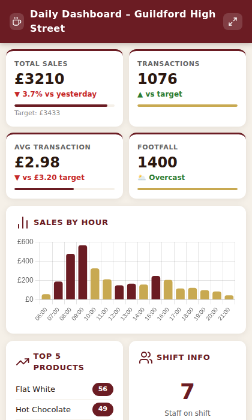

---

### 📅 Shift Rota
The weekly rota grid shows a circular SVG avatar for each crew member. Today's column is gold-highlighted. Unfilled shifts surface a "Find Cover" prompt button. Each row is clickable to view that employee's training.

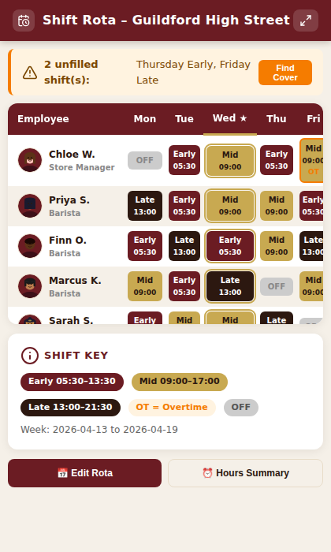

---

### 📦 Stock Levels
Category filter buttons, stock health doughnut chart, per-item category icons, and a single-click "Generate Stock Order" button that prompts Copilot to produce the full order.

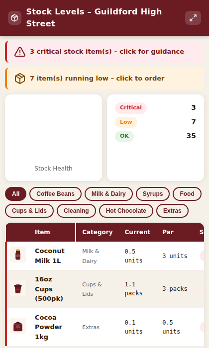

---

### 👨‍🍳 Recipe Card – Caramel Latte
Every recipe card shows a Costa-style drink image, category pill, and Guide Me button. Allergen cells are clickable (sends a customer allergen guidance prompt). The Barista Tip box and Guide Me button both trigger follow-on prompts.

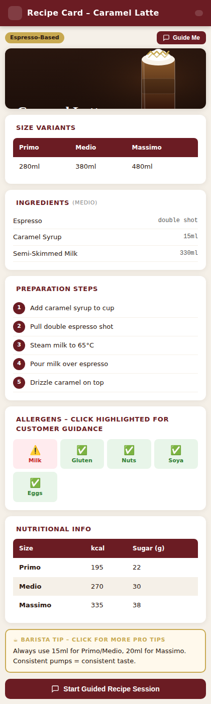

---

### 🎓 Training Progress – Store Overview
Team training completion KPIs and a per-employee table. Click any row to view that employee's individual progress.

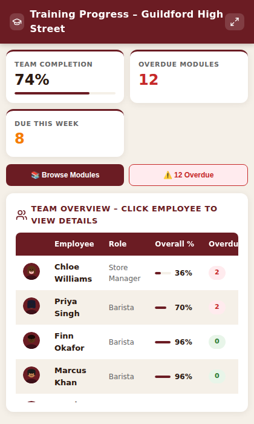

---

### 🎓 Training Progress – Employee Detail
Individual training progress with module-level progress bars and Costa-branded module images. Click any module to launch the video player.

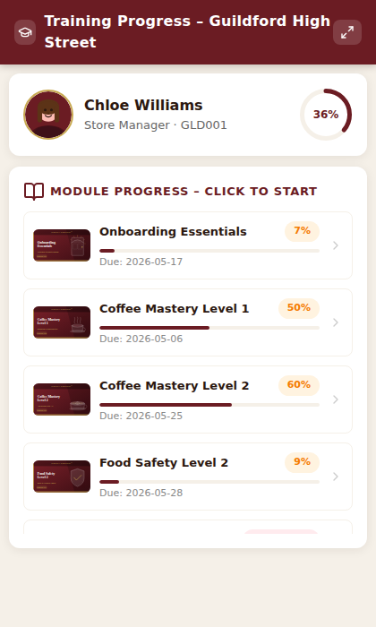

---

### 📚 Training Module Catalogue
All 12 training modules displayed as cards with bespoke Costa-branded SVG images, "Video" and "REQUIRED" badges, and a live search filter. Clicking any card sends a follow-on prompt to Copilot.

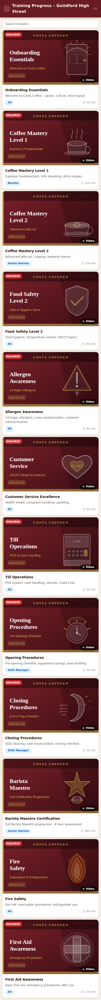

---

### ▶️ Training Video Player
The video widget shows the module thumbnail, progress tracker, and three guided action buttons that chain into Copilot (guided learning, mark complete, knowledge check). When an actual `.mp4` file is deployed it will auto-play inline.

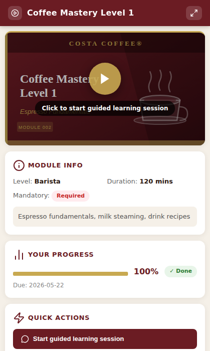

---

### ✅ Compliance Checklist
Daily, weekly, and monthly compliance checklists with tab navigation and interactive check items.

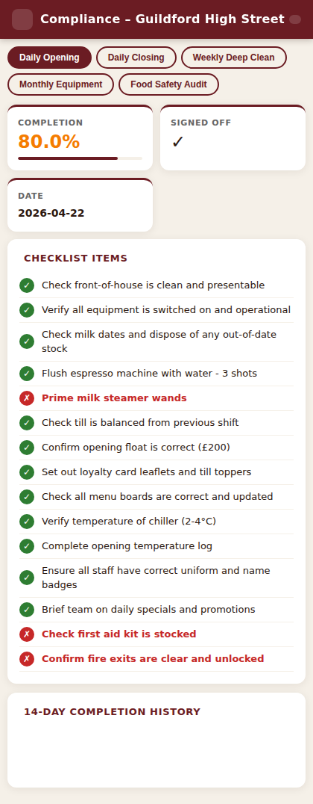

---

### ⚠️ Incident Log
Searchable incident log with severity badges, status tracking, and a quick-submit form for new incidents.

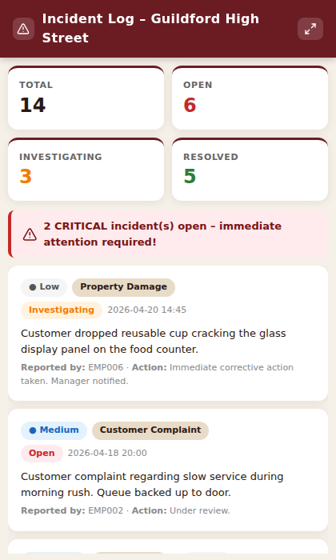

---

### 💬 Customer Feedback
NPS score, star rating breakdown, a 12-week NPS trend chart, and paginated recent reviews.

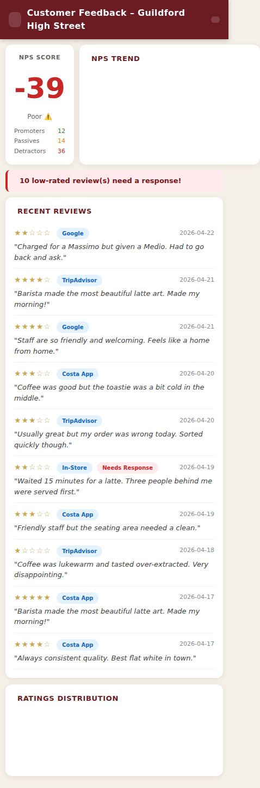

---

### 🗺️ Regional Benchmarks
Cross-store performance league table with weekly sales, NPS, compliance, and transaction metrics.

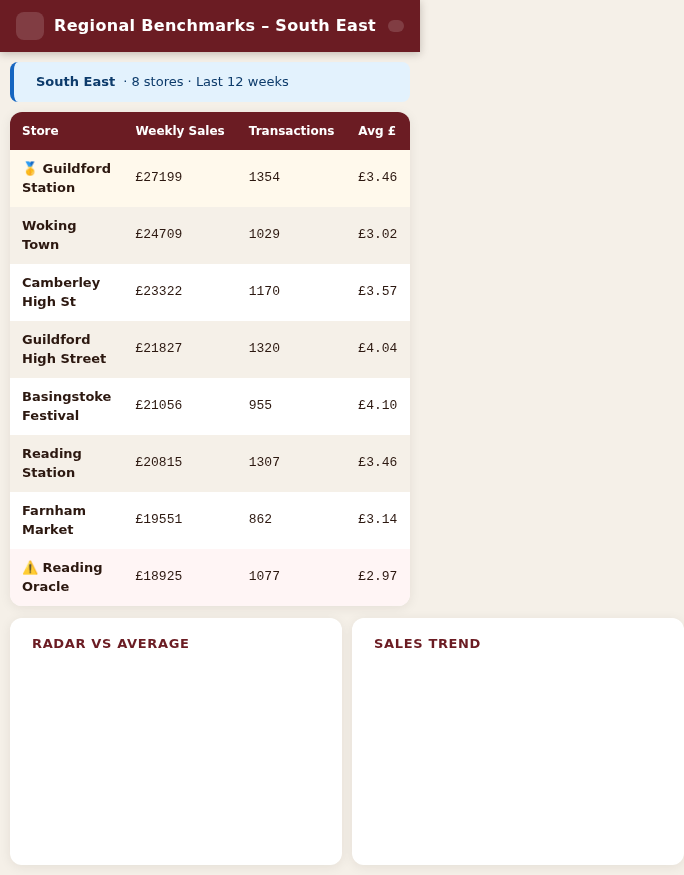

---

### 🔧 Maintenance Requests
Kanban-style maintenance tracker with priority badges and status columns.

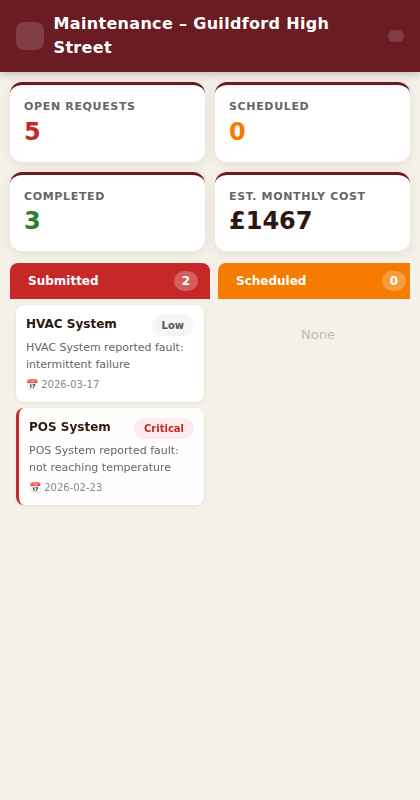

---

### 📣 Promotions
Active promotional offers with POS codes, discount details, and guidance prompts.

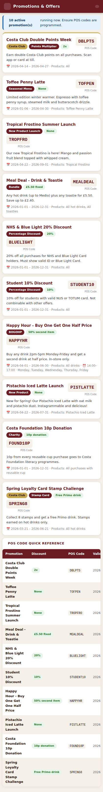

---

### 🔄 Shift Handover
Structured shift handover notes with action items, outstanding tasks, and a submit form for the next shift.

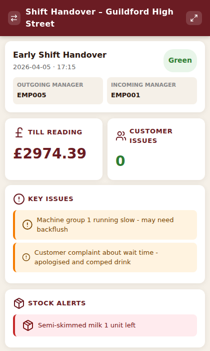

---

### 🌤️ Weather & Footfall
Hourly forecast, 3-day outlook, and AI-powered footfall impact predictions. Nearby local events (concerts, football matches, parkruns) surface automatically with preparation tips. Every day card is clickable to ask Copilot for a tailored operational plan.

---

### 🚆 Travel Updates
Live transport disruption feed – rail strikes, signal failures, road closures – with per-disruption staff impact (which team members might be late) and customer footfall implications. One-tap "How should I respond?" sends context straight to Copilot.

---

### 📱 Social Pulse
Real-time social media sentiment across Instagram, TikTok, X (Twitter), Google Reviews, and TripAdvisor. Surfaces viral posts, influencer opportunities, and complaints needing urgent response. One-tap drafts a suggested reply via Copilot.

---

## Architecture

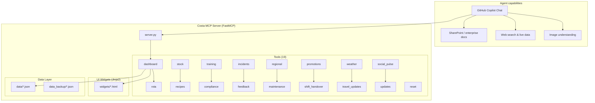

---

## Features

### Core Widgets

| Module | Tool | Description |
|--------|------|-------------|
| 📊 Dashboard | `get_daily_dashboard` | Sales KPIs, hourly chart, top products |
| 📅 Rota | `get_shift_rota` | Weekly shift grid with crew avatars & overtime flags |
| 📦 Stock | `get_stock_levels` | Real-time stock with category icons & critical alerts |
| 👨‍🍳 Recipes | `get_recipe` | Full recipe cards with drink image, allergens & tips |
| 🎓 Training | `get_training_progress` | Individual/team training progress with module images |
| 📚 Modules | `get_training_modules` | Visual catalogue of all 12 training modules |
| ▶️ Video | `play_training_video` | Training video player with progress & guided actions |
| ✅ Compliance | `get_compliance_checklist` | Daily/weekly/monthly checklists |
| ⚠️ Incidents | `get_incidents`, `submit_incident` | Incident log and reporting |
| 💬 Feedback | `get_customer_feedback` | NPS, star ratings, trend analysis |
| 🗺️ Regional | `get_regional_benchmarks` | Cross-store performance comparison |
| 🔧 Maintenance | `get_maintenance_requests` | Kanban-style maintenance tracker |
| 📣 Promotions | `get_current_promotions` | Active offers and POS codes |
| 🔄 Handover | `get_shift_handover`, `submit_shift_handover` | Shift handover notes |
| 🌤️ Weather | `get_weather_forecast` | Hourly forecast, footfall impact & local events |
| 🚆 Travel | `get_travel_updates` | Transport disruptions, staff & customer impact |
| 📱 Social | `get_social_pulse` | Social sentiment, viral posts & complaint alerts |

### Update & Correction Tools

| Tool | Description |
|------|-------------|
| `update_training_progress` | Update employee module completion % and status |
| `update_stock_level` | Correct stock level for any item in any store |
| `update_rota_shift` | Change a shift for any employee on any day |
| `log_corrective_action` | Log management actions taken (stock order, compliance fix, etc.) |
| `get_corrective_actions` | List all logged corrective actions |
| `close_corrective_action` | Resolve and close a corrective action |

### Demo Management

| Tool | Description |
|------|-------------|
| `reset_demo` | Restore all JSON data files to original state (requires `confirm=True`) |
| `get_demo_status` | View current data state, modification count, and whether demo has been changed |

---

## Why an AI Agent — Not Just a Mobile App

A mobile app gives you menus and screens. This AI agent gives you a **thinking partner** that:

| Capability | Mobile App | AI Agent |
|-----------|-----------|---------|
| Check stock levels | ✅ Shows a list | ✅ Shows widget **+** explains root cause **+** drafts the supplier email |
| Weather impact on footfall | ❌ No | ✅ Combines forecast + local events + store history → specific staffing advice |
| Train strike affects my team | ❌ No | ✅ Identifies affected staff by name + recommends cover actions |
| "Is this drink right?" (photo) | ❌ No | ✅ Reads the image, compares to recipe, advises corrective action |
| New regional HR policy on SharePoint | ❌ No | ✅ Reads the document + tells you what it means for your store today |
| Viral TikTok about your store | ❌ No | ✅ Surfaces the post, drafts a reply, suggests escalating to marketing |
| Multi-step workflows | ❌ Navigate menus | ✅ One conversation chains: stock → order → log action → notify manager |
| Context across sources | ❌ One system | ✅ Blends MCP data + SharePoint docs + live web + uploaded images |

---

## Widget Chaining with `openai.apps.sendMessage`

Every interactive element in the widgets uses the OpenAI Apps SDK `sendMessage` API to send follow-on prompts back to Copilot. This creates guided, chained workflows:

```
get_weather_forecast("GLD001")
  → Rainy morning + Guildford Live Festival on Saturday
    → click Saturday forecast card → sendMessage("What should I prepare for Saturday's festival footfall?")
      → Agent: checks stock levels, rota, iced drinks range
        → "You'll need 3 extra staff, double oat milk order, push Frostinos"
```

```
get_travel_updates("GLD002")
  → Major rail disruption – 2 staff may be late
    → click "How should I respond?" → sendMessage("Rail disruption affecting Jade and Tariq...")
      → Agent: contacts staff, adjusts rota, advises counter prep for surge
```

```
get_social_pulse("GLD001")
  → Queue complaint tweet during morning rush
    → click alert card → sendMessage("Draft a response to this tweet about queue length")
      → Agent: drafts empathetic reply referencing rail disruption context
```

```
get_training_progress (store overview)
  → click employee row → sendMessage("Show training for EMP001")
    → get_training_progress (employee view)
      → click module card → sendMessage("Play training module TM002")
        → play_training_video (video player widget)
          → click "Mark as Complete" → sendMessage("Mark TM002 complete for EMP001")
            → update_training_progress (tool call, saves to JSON)
```

```
get_stock_levels
  → click critical item → sendMessage("What should I do about espresso beans being critical?")
    → log_corrective_action (logs management action to JSON)
```

```
get_recipe (click allergen cell)
  → sendMessage("Customer has milk allergy asking about Caramel Latte. What should I tell them?")
    → Guided allergen response with alternatives
```

---

## Static Assets

All images are Costa-branded SVG files that render crisply at any size:

```
static/
├── images/
│   ├── training/          # 12 module cards (tm001.svg … tm012.svg)
│   ├── crew/              # 9+ diverse crew avatars (emp001.svg … emp009.svg)
│   ├── recipes/           # 30 drink images (flat_white.svg, latte.svg, …)
│   └── stock/             # Category icons (coffee_beans.svg, milk.svg, …)
└── media/
    ├── tm001_onboarding_essentials.mp4         ← replace with actual video
    ├── tm002_coffee_mastery_l1.mp4
    ├── tm003_coffee_mastery_l2.mp4
    └── … (12 modules total)
```

> **To add real videos:** Drop `.mp4` files into `static/media/` matching the placeholder filenames. The training video widget will auto-detect them and show an HTML5 `<video>` player instead of the clickable thumbnail.

---

## Widget Preview (Local Development)

Preview all widgets in your VS Code browser without running the full MCP server:

```bash
python widget-preview.py
# Opens at http://localhost:5050
```

- Left sidebar lists all widgets with variant links
- Widget renders in a 420px mobile-sized frame (matches Copilot panel width)
- Static files (SVGs, media) are served automatically
- Errors are shown inline with full traceback

---

## Local Setup

```bash
# 1. Clone and install
git clone https://github.com/scadam/retail-mcp.git
cd retail-mcp
pip install -r requirements.txt

# 2. Run the MCP server
python server.py
# → http://0.0.0.0:8000

# 3. OR preview widgets only
python widget-preview.py
# → http://localhost:5050
```

Configure in your MCP client (e.g. `.vscode/mcp.json`):
```json
{
  "mcpServers": {
    "costa": {
      "url": "http://localhost:8000/mcp"
    }
  }
}
```

---

## Demo Walkthrough – Sam's Wednesday Morning at GLD001

> **The scenario:** Sam is the opening shift manager at Costa Guildford High Street. It's 7:15am on a rainy Wednesday. There's been a rail disruption on the South Western Railway line and Sam has just unlocked the store. Their phone is in their pocket — they're talking to the agent hands-free while doing the opening checks.
>
> The agent has access to: the MCP server (store data), SharePoint (HR policies & operational manuals), web search (live weather, transport updates), and can understand photos Sam uploads.

---

**Scene 1 – The morning briefing in one question**

> "Morning. What do I need to know about today?"

→ Agent runs `get_weather_forecast("GLD001")` + `get_travel_updates("GLD001")` in parallel  
→ 🌤️ **Weather widget** appears: Rainy morning (80% rain probability 8–9am), footfall impact **+18%** — *rain drives customers in*  
→ 🚆 **Travel widget** appears: Major SWR rail disruption — trains 25–40 min late. *"Jade and Tariq commute from Woking — they may be late. Expect surge of stranded commuters from 7:30am."*  
→ Agent: *"Big morning incoming, Sam. Rain + rail chaos = lots of people sheltering with a coffee. I'd double-check your oat milk and takeaway cup stock, and give Jade a call to get her ETA before the rush hits."*

> **Why not a mobile app?** No app combines live weather, live transport, your specific staff's commute routes, and your store's stock levels into a single morning briefing sentence.

---

**Scene 2 – Photo of the milk fridge**

> "The milk fridge looks off — let me show you."

→ Sam uploads a photo of the fridge display panel showing 8°C (should be 1–5°C)  
→ Agent reads the image: *"That temperature is out of range for food safety — legal requirement is 1–5°C. You'll need to log this as a compliance issue and check if the milk is still safe to use."*  
→ Agent calls `get_compliance_checklist("GLD001", "daily_opening")` → ✅ **Compliance widget** opens, highlighting the temperature check item as failed  
→ Agent calls `submit_incident("GLD001", "Food Safety", "High", "Milk fridge reading 8°C at opening — above legal limit", "Sam Mitchell")`  
→ *"Incident logged as INC-A7F2. I've also checked your SharePoint food safety manual — if temp has been above 5°C for more than 4 hours, the milk must be discarded. Do you know when it last checked in range?"*

> **Why not a mobile app?** The app can't read a photo, cross-reference the food safety policy from SharePoint, and log the incident in one conversational turn.

---

**Scene 3 – Oat milk is critical**

> "Show me stock before I brief the team."

→ `get_stock_levels("GLD001")` → 📦 **Stock widget** opens  
→ Critical alert: *Oat milk — 2 units remaining (par level: 12)*  
→ Sam clicks the alert banner in the widget → `sendMessage("Oat milk is critical at GLD001 — 2 units. What do I do?")`  
→ Agent: *"That won't get you through the morning rush, especially with today's expected footfall spike. I'd suggest two things: call the Guildford Station Costa (GLD002) to borrow stock as an emergency transfer — they have 9 units. And I'll log a priority order with your supplier. Want me to draft both right now?"*  
→ Agent calls `log_corrective_action(...)` → action saved to JSON

---

**Scene 4 – Who's on and who's late?**

> "Show me the rota — Jade and Tariq are probably stuck on the train."

→ `get_shift_rota("GLD001")` → 📅 **Rota widget** opens, today highlighted in gold  
→ Sam clicks Jade's row → `sendMessage("Show me Jade's training")` → training widget opens  
→ Sam asks: *"Can Maya cover the counter until Jade arrives?"*  
→ Agent: *"Maya is scheduled on pastries until 9am, but she's Allergen Awareness certified and has done counter shifts before. Yes, she can cover — want me to update today's rota to reflect that?"*  
→ `update_rota_shift(...)` → rota updated in JSON

---

**Scene 5 – New starter asks about a recipe**

> "Chloe just started last week — she's asking how to make a Caramel Latte."

→ `get_recipe("Caramel Latte")` → 👨‍🍳 **Recipe widget** opens with full recipe card  
→ Chloe spots the milk allergen icon and asks: *"What do I tell a customer with a milk allergy?"*  
→ Clicks the milk allergen cell → `sendMessage("Customer has milk allergy asking about Caramel Latte")`  
→ Agent: *"For a milk allergy, the Caramel Latte is not safe in any variant — caramel syrup also contains milk derivatives. Recommend the Americano with oat milk (check label — our supplier's oat milk is dairy-free and nut-free) or the Chai Latte with coconut milk. Always check the allergen binder for current batch info."*

---

**Scene 6 – Training check on Chloe**

> "How is Chloe getting on with her training?"

→ `get_training_progress(employee_id="EMP009")` → 🎓 **Training widget** (employee view)  
→ Coffee Mastery Level 1 is overdue — due 3 days ago  
→ Sam clicks the module card → `play_training_video("TM002", "EMP009")` → ▶️ **Video player widget**  
→ Chloe watches the video on her phone during a quiet moment  
→ Clicks "Mark as Complete" → `update_training_progress(...)` → JSON updated  
→ Agent: *"TM002 marked complete for Chloe. She still has Allergen Awareness (TM005) due next week — want me to schedule a reminder?"*

---

**Scene 7 – Dashboard check at 9am**

> "How are we tracking?"

→ `get_daily_dashboard("GLD001")` → 📊 **Dashboard widget**  
→ £847 revenue by 9am — 23% ahead of the same time yesterday  
→ Sam: *"This is because of the rail disruption, isn't it?"*  
→ Agent: *"Exactly — your morning rush ran nearly 30 minutes longer than usual and average transaction value is up £0.40, which suggests people added a food item while waiting. This is a good opportunity to push the Meal Deal promotion today."*  
→ Agent calls `get_current_promotions("GLD001")` → 📣 **Promotions widget** opens showing the active Meal Deal POS code

---

**Scene 8 – The viral TikTok**

> "What are people saying about us online?"

→ `get_social_pulse("GLD001")` → 📱 **Social Pulse widget** opens  
→ 🔥 Trending: *Iced Caramel Latte* — @guildford_foodie's Instagram post has 847 likes overnight  
→ ⚠️ Alert: A tweet from @commuter_dave complaining about a 12-minute wait this morning  
→ Sam clicks the alert card → `sendMessage("Draft a response to this tweet about queue length")`  
→ Agent: *"Here's a suggested reply: 'Hi @commuter_dave — really sorry for the wait! We had an exceptionally busy morning thanks to the SWR disruptions. Your patience means a lot — hope we can make it up to you ☕' — want me to adjust the tone or add anything?"*  
→ Sam clicks the influencer card → Agent: *"@guildford_foodie has 12k followers. This is a good moment to build a relationship — I can draft a friendly DM inviting her back for a behind-the-scenes session, or flag it to your regional marketing team via the area manager channel on SharePoint. Which would you prefer?"*

> **Why not a mobile app?** A social listening dashboard shows you the posts. The agent reads the context (rail disruption → queue complaint), drafts the response, and knows how to escalate — all in one turn.

---

**Scene 9 – Area manager memo just landed on SharePoint**

> "I got a notification that there's a new area manager memo on SharePoint — something about the Q2 upselling targets."

→ Agent searches SharePoint for the document (native Copilot capability, no MCP tool needed)  
→ Agent reads the memo and cross-references against GLD001's current performance  
→ *"The memo sets a Q2 target of 18% Meal Deal attachment rate — you're currently at 14% for this week. The good news is today's high footfall is a perfect opportunity. The memo also mentions a new Barista Maestro incentive scheme — want me to check which of your team are eligible based on their training progress?"*  
→ `get_training_progress("GLD001")` → **Training overview** shows 2 staff within 2 modules of Barista Maestro certification

---

**Scene 10 – Customer complaint about a wrong order (with photo)**

> "A customer says their drink looks wrong — they've shown me a photo."

→ Sam uploads the customer's photo showing a flat white in what appears to be a medium cup  
→ Agent: *"That looks like a Medio (12oz) flat white. According to the recipe card, a Medio flat white should be a double ristretto with 180ml steamed milk, leaving about 1cm headspace. The cup in the photo looks right for a Medio — it may just be the angle. Is the customer saying the size is wrong, or the taste?"*  
→ Sam: *"They say it tastes too milky."*  
→ Agent: *"In that case, check the grind setting — a coarser grind will produce a weaker ristretto that gets lost in the milk. The Barista Tip on the recipe card covers this. I'd suggest a complimentary remake and log it as a 'product quality' entry in the feedback log."*

---

**Scene 11 – Compliance check at lunch**

> "Pull up the opening checklist — I need to sign it off before my area manager visit."

→ `get_compliance_checklist("GLD001", "daily_opening")` → ✅ **Compliance widget**  
→ Milk fridge temperature check shows as Failed (from Scene 2)  
→ Agent: *"Your area manager will see the failed temperature item. I'd recommend adding a note explaining the corrective action you took — I logged the incident earlier so it's on record. The SharePoint ops manual says you need to document the remediation steps within 2 hours of discovery. Want me to pull up the template?"*

---

**Scene 12 – Shift handover at 2pm**

> "Help me write up the handover for the afternoon team."

→ `get_shift_handover("GLD001")` → 🔄 **Shift Handover widget**  
→ Agent pre-populates based on today's events: rail disruption, milk fridge incident, high footfall, Jade's late arrival, Chloe's training completion, social media alert  
→ *"Here's a draft handover: Key items for the afternoon team — 1) Oat milk critically low (order placed, delivery expected tomorrow). 2) Milk fridge was above temp this morning — engineer has been called. 3) Strong sales day — you're on track to exceed daily target. 4) Respond to the Twitter complaint if not already done. 5) Chloe has completed TM002, eligible for till training next week."*  
→ `submit_shift_handover(...)` → handover saved

---

**Scene 13 – Weekend prep (Saturday festival)**

> "What do I need to do before the weekend?"

→ Agent recalls from the Weather widget that the Guildford Live Music Festival is Saturday with 8,000 expected attendees and +35% footfall impact  
→ Agent runs `get_stock_levels("GLD001")` to check iced drink supplies  
→ *"Saturday is going to be huge — 8,000 festival-goers 0.4 miles away. Here's your weekend prep checklist: Double your Frostino syrups order; ensure Iced Caramel Latte is on your feature board (it's already trending on social); request 2 extra staff for the 11am–5pm peak; check you have enough 16oz cups for iced orders; and contact your area manager about extended trading hours — there's a template request on SharePoint under 'Extended Hours Requests'."*

---

**Scene 14 – Reset demo for next presentation**

> "Reset everything back to the starting state."

→ `get_demo_status()` → shows all changes made during the demo  
→ `reset_demo(confirm=True)` → all JSON files restored to original state

---

**Scene 15 – Regional manager view**

> "How is South East performing vs region?"

→ `get_regional_benchmarks("South East")` → 🗺️ **Regional Benchmarks widget** — league table of all 5 stores

---

## Stores Covered

| ID | Store | Region |
|----|-------|--------|
| GLD001 | Guildford High Street | South East |
| GLD002 | Guildford Station | South East |
| RDG001 | Reading Oracle | South East |
| RDG002 | Reading Station | South East |
| BAS001 | Basingstoke Festival Place | South East |

---

## Project Structure

```
retail-mcp/
├── server.py                    # FastMCP server entry point (19 tool modules)
├── widget-preview.py            # Local widget preview server (http://localhost:5050)
├── branding/
│   └── costa_theme.py           # Centralised Costa brand colours & fonts
├── tools/                       # MCP tool modules
│   ├── dashboard.py             # Daily sales dashboard
│   ├── rota.py                  # Shift rota management
│   ├── stock.py                 # Stock level monitoring
│   ├── recipes.py               # Recipe cards
│   ├── training.py              # Training progress + video player + module catalogue
│   ├── compliance.py            # Compliance checklists
│   ├── incidents.py             # Incident log
│   ├── feedback.py              # Customer NPS & feedback
│   ├── regional.py              # Regional benchmarks
│   ├── maintenance.py           # Maintenance requests
│   ├── promotions.py            # Active promotions
│   ├── shift_handover.py        # Shift handovers
│   ├── weather.py               # ✨ NEW: Weather forecast + footfall impact + local events
│   ├── travel.py                # ✨ NEW: Travel disruptions, staff & customer impact
│   ├── social.py                # ✨ NEW: Social media pulse, sentiment & alerts
│   ├── updates.py               # update_training_progress, update_stock_level,
│   │                            #         update_rota_shift, log_corrective_action, …
│   └── reset.py                 # reset_demo, get_demo_status
├── widgets/                     # Jinja2 HTML widget templates
│   ├── base.html                # Costa-themed base layout
│   ├── dashboard.html
│   ├── rota.html
│   ├── stock.html
│   ├── recipe_card.html
│   ├── training.html
│   ├── training_video.html
│   ├── compliance_checklist.html
│   ├── incident_log.html
│   ├── feedback.html
│   ├── regional_benchmarks.html
│   ├── maintenance.html
│   ├── promotions.html
│   ├── shift_handover.html
│   ├── weather.html             # ✨ NEW: Hourly forecast, footfall badges, events
│   ├── travel_updates.html      # ✨ NEW: Disruption cards, staff/customer impact
│   └── social_pulse.html        # ✨ NEW: Social feed, sentiment, reply drafting
├── static/
│   ├── images/
│   │   ├── training/            # 12 Costa-branded training module SVGs
│   │   ├── crew/                # Diverse crew member avatar SVGs
│   │   ├── recipes/             # 30 Costa drink SVG images
│   │   └── stock/               # Stock category icon SVGs
│   └── media/
│       └── tm001_…tm012_*.mp4   # Video placeholders (replace with real .mp4s)
├── data/                        # Live JSON data files
│   ├── weather.json             # ✨ NEW: Weather forecasts + local events per store
│   ├── travel_updates.json      # ✨ NEW: Transport disruptions per store
│   └── social_pulse.json        # ✨ NEW: Social media mentions & sentiment per store
├── data_backup/                 # Original data (used by reset_demo tool)
├── requirements.txt
├── Dockerfile
└── deploy.sh                    # Azure Container Apps deployment
```

---

## Azure Container Apps Deployment

```bash
# Deploy to Azure (requires az CLI logged in)
chmod +x deploy.sh
./deploy.sh my-resource-group uksouth
```

## Environment Variables

| Variable | Default | Description |
|----------|---------|-------------|
| `MCP_HOST` | `0.0.0.0` | Server bind address |
| `MCP_PORT` | `8000` | Server port |

---

*Built with [FastMCP](https://github.com/jlowin/fastmcp) · Costa Coffee brand assets used for demonstration purposes only.*


### 📊 Dashboard
Daily sales KPIs, hourly revenue chart, and top-selling products at a glance.


---

### 📅 Shift Rota
The weekly rota grid shows a circular SVG avatar for each crew member. Today's column is gold-highlighted. Unfilled shifts surface a "Find Cover" prompt button. Each row is clickable to view that employee's training.


---

### 📦 Stock Levels
Category filter buttons, stock health doughnut chart, per-item category icons, and a single-click "Generate Stock Order" button that prompts Copilot to produce the full order.


---

### 👨‍🍳 Recipe Card – Caramel Latte
Every recipe card shows a Costa-style drink image, category pill, and Guide Me button. Allergen cells are clickable (sends a customer allergen guidance prompt). The Barista Tip box and Guide Me button both trigger follow-on prompts.


---

### 🎓 Training Progress – Store Overview
Team training completion KPIs and a per-employee table. Click any row to view that employee's individual progress.


---

### 🎓 Training Progress – Employee Detail
Individual training progress with module-level progress bars and Costa-branded module images. Click any module to launch the video player.


---

### 📚 Training Module Catalogue
All 12 training modules displayed as cards with bespoke Costa-branded SVG images, "Video" and "REQUIRED" badges, and a live search filter. Clicking any card sends a follow-on prompt to Copilot.


---

### ▶️ Training Video Player
The video widget shows the module thumbnail, progress tracker, and three guided action buttons that chain into Copilot (guided learning, mark complete, knowledge check). When an actual `.mp4` file is deployed it will auto-play inline.


---

### ✅ Compliance Checklist
Daily, weekly, and monthly compliance checklists with tab navigation and interactive check items.


---

### ⚠️ Incident Log
Searchable incident log with severity badges, status tracking, and a quick-submit form for new incidents.


---

### 💬 Customer Feedback
NPS score, star rating breakdown, a 12-week NPS trend chart, and paginated recent reviews.


---

### 🗺️ Regional Benchmarks
Cross-store performance league table with weekly sales, NPS, compliance, and transaction metrics.


---

### 🔧 Maintenance Requests
Kanban-style maintenance tracker with priority badges and status columns.


---

### 📣 Promotions
Active promotional offers with POS codes, discount details, and guidance prompts.


---

### 🔄 Shift Handover
Structured shift handover notes with action items, outstanding tasks, and a submit form for the next shift.


---

