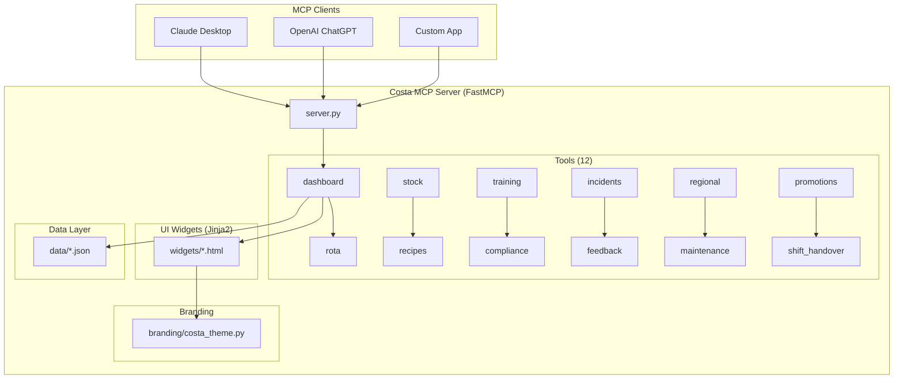

# ☕ Costa Coffee Frontline AI Agent MCP Server

An [MCP (Model Context Protocol)](https://modelcontextprotocol.io) server that powers a Costa Coffee frontline AI assistant for baristas, shift managers, store managers, and regional/area managers.

## Architecture



## Features

| Module | Tool | Description |
|--------|------|-------------|
| 📊 Dashboard | `get_daily_dashboard` | Sales KPIs, hourly chart, top products |
| 📅 Rota | `get_shift_rota` | Weekly shift grid with overtime flags |
| 📦 Stock | `get_stock_levels` | Real-time stock with critical alerts |
| 👨‍🍳 Recipes | `get_recipe` | Full recipe cards with allergens |
| 🎓 Training | `get_training_progress` | Individual/team training progress |
| ✅ Compliance | `get_compliance_checklist` | Daily/weekly/monthly checklists |
| ⚠️ Incidents | `get_incidents`, `submit_incident` | Incident log and reporting |
| 💬 Feedback | `get_customer_feedback` | NPS, star ratings, trend analysis |
| 🗺️ Regional | `get_regional_benchmarks` | Cross-store performance comparison |
| 🔧 Maintenance | `get_maintenance_requests` | Kanban-style maintenance tracker |
| 📣 Promotions | `get_current_promotions` | Active offers and POS codes |
| 🔄 Handover | `get_shift_handover`, `submit_shift_handover` | Shift handover notes |

## Stores Covered

| ID | Store | Region |
|----|-------|--------|
| GLD001 | Guildford High Street | South East |
| GLD002 | Guildford Station | South East |
| RDG001 | Reading Oracle | South East |
| RDG002 | Reading Station | South East |
| BAS001 | Basingstoke Festival Place | South East |

## Local Setup

```bash
# 1. Clone and install
git clone https://github.com/scadam/retail-mcp.git
cd retail-mcp
pip install -r requirements.txt

# 2. Run the server
python server.py

# Server starts at http://0.0.0.0:8000
```

Configure in your MCP client:
```json
{
  "mcpServers": {
    "costa": {
      "url": "http://localhost:8000/mcp"
    }
  }
}
```

## Demo Walkthrough – Sam at GLD001

**Scene 1 – Morning rush prep**
> "What's our stock looking like this morning?"
→ `get_stock_levels("GLD001")` → Oat milk critical alert

**Scene 2 – Who's on today?**
> "Show me today's rota"
→ `get_shift_rota("GLD001")` → Week grid with today highlighted

**Scene 3 – New starter asks about a recipe**
> "How do I make a Flat White?"
→ `get_recipe("Flat White")` → Full recipe card with Barista Tip

**Scene 4 – Dashboard check at 9am**
> "How are we tracking vs target?"
→ `get_daily_dashboard("GLD001")` → KPIs, hourly chart

**Scene 5 – Opening compliance**
> "Pull up the opening checklist"
→ `get_compliance_checklist("GLD001", "daily_opening")` → Checklist view

**Scene 6 – Customer complaint**
> "Log an incident - customer slipped near the door"
→ `submit_incident(...)` → Incident created

**Scene 7 – Training check**
> "Who needs to complete Food Safety training?"
→ `get_training_progress(store_id="GLD001")` → Team overview

**Scene 8 – Shift handover**
> "Fill in the handover for the early shift"
→ `submit_shift_handover(...)` → Handover saved

**Scene 9 – Regional manager view**
> "How is South East performing vs region?"
→ `get_regional_benchmarks("South East")` → Radar chart + league table

**Scene 10 – Promotions**
> "What offers are running this week?"
→ `get_current_promotions()` → Active promos with POS codes

## Azure Container Apps Deployment

```bash
# Deploy to Azure (requires az CLI logged in)
chmod +x deploy.sh
./deploy.sh my-resource-group uksouth
```

The script will:
1. Create an Azure Container Registry
2. Build and push the Docker image
3. Create a Container Apps environment
4. Deploy with auto-scaling (1-5 replicas)
5. Output the public HTTPS URL

## Environment Variables

| Variable | Default | Description |
|----------|---------|-------------|
| `MCP_HOST` | `0.0.0.0` | Server bind address |
| `MCP_PORT` | `8000` | Server port |

## Project Structure

```
retail-mcp/
├── server.py              # FastMCP server entry point
├── branding/
│   └── costa_theme.py     # Centralised Costa brand colours & fonts
├── tools/                 # 12 MCP tool modules
├── widgets/               # Jinja2 HTML widget templates
├── data/                  # JSON data files
├── requirements.txt
├── Dockerfile
└── deploy.sh              # Azure Container Apps deployment
```

---

*Built with [FastMCP](https://github.com/jlowin/fastmcp) · Costa Coffee brand assets used for demonstration purposes only.*
