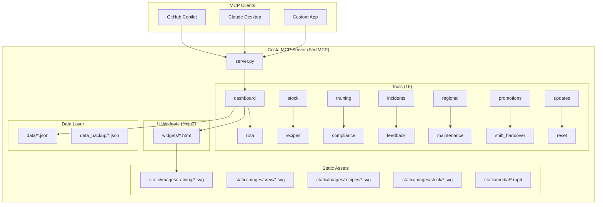

# ☕ Costa Coffee Frontline AI Agent MCP Server

An [MCP (Model Context Protocol)](https://modelcontextprotocol.io) server that powers a Costa Coffee frontline AI assistant for baristas, shift managers, store managers, and regional/area managers. Built with [FastMCP](https://github.com/jlowin/fastmcp) and rendered via Jinja2 HTML widgets.

---

## Widget Screenshots

### 🎓 Training Module Catalogue
Each of the 12 training modules has a bespoke Costa-branded SVG image with "Video" and "REQUIRED" badges. Clicking any module card sends a follow-on prompt to Copilot to launch the video player.


---

### ▶️ Training Video Player
The video widget shows the module thumbnail, progress tracker, and three guided action buttons that chain into Copilot (guided learning, mark complete, knowledge check). When an actual `.mp4` file is deployed it will auto-play inline.


---

### 👨‍🍳 Recipe Card – Caramel Latte
Every recipe card now shows a Costa-style drink image header. Allergen cells are clickable (sends a customer allergen guidance prompt). The Barista Tip box and Guide Me button both trigger follow-on prompts.


---

### 📅 Shift Rota
The weekly rota grid now shows a circular SVG avatar for each crew member (diverse fictional team). Today's column is gold-highlighted. Unfilled shifts surface a "Find Cover" prompt button. Each row is clickable to view that employee's training.


---

### 📦 Stock Levels
Category filter buttons, stock health doughnut chart, per-item category icons, and a single-click "Generate Stock Order" button that prompts Copilot to produce the full order.


---

## Architecture



---

## Features

### Core Widgets

| Module | Tool | Description |
|--------|------|-------------|
| 📊 Dashboard | `get_daily_dashboard` | Sales KPIs, hourly chart, top products |
| 📅 Rota | `get_shift_rota` | Weekly shift grid with crew avatars & overtime flags |
| 📦 Stock | `get_stock_levels` | Real-time stock with category icons & critical alerts |
| 👨‍🍳 Recipes | `get_recipe` | Full recipe cards with drink image, allergens & tips |
| 🎓 Training | `get_training_progress` | Individual/team training progress with module images |
| 📚 Modules | `get_training_modules` | Visual catalogue of all 12 training modules |
| ▶️ Video | `play_training_video` | Training video player with progress & guided actions |
| ✅ Compliance | `get_compliance_checklist` | Daily/weekly/monthly checklists |
| ⚠️ Incidents | `get_incidents`, `submit_incident` | Incident log and reporting |
| 💬 Feedback | `get_customer_feedback` | NPS, star ratings, trend analysis |
| 🗺️ Regional | `get_regional_benchmarks` | Cross-store performance comparison |
| 🔧 Maintenance | `get_maintenance_requests` | Kanban-style maintenance tracker |
| 📣 Promotions | `get_current_promotions` | Active offers and POS codes |
| 🔄 Handover | `get_shift_handover`, `submit_shift_handover` | Shift handover notes |

### New Update & Correction Tools

| Tool | Description |
|------|-------------|
| `update_training_progress` | Update employee module completion % and status |
| `update_stock_level` | Correct stock level for any item in any store |
| `update_rota_shift` | Change a shift for any employee on any day |
| `log_corrective_action` | Log management actions taken (stock order, compliance fix, etc.) |
| `get_corrective_actions` | List all logged corrective actions |
| `close_corrective_action` | Resolve and close a corrective action |

### Demo Management

| Tool | Description |
|------|-------------|
| `reset_demo` | Restore all JSON data files to original state (requires `confirm=True`) |
| `get_demo_status` | View current data state, modification count, and whether demo has been changed |

---

## Widget Chaining with `openai.apps.sendMessage`

Every interactive element in the widgets uses the OpenAI Apps SDK `sendMessage` API to send follow-on prompts back to Copilot. This creates guided, chained workflows:

```
get_training_progress (store overview)
  → click employee row → sendMessage("Show training for EMP001")
    → get_training_progress (employee view)
      → click module card → sendMessage("Play training module TM002")
        → play_training_video (video player widget)
          → click "Mark as Complete" → sendMessage("Mark TM002 complete for EMP001")
            → update_training_progress (tool call, saves to JSON)
```

```
get_stock_levels
  → click critical item → sendMessage("What should I do about espresso beans being critical?")
    → log_corrective_action (logs management action to JSON)
```

```
get_recipe (click allergen cell)
  → sendMessage("Customer has milk allergy asking about Caramel Latte. What should I tell them?")
    → Guided allergen response with alternatives
```

---

## Static Assets

All images are Costa-branded SVG files that render crisply at any size:

```
static/
├── images/
│   ├── training/          # 12 module cards (tm001.svg … tm012.svg)
│   ├── crew/              # 9+ diverse crew avatars (emp001.svg … emp009.svg)
│   ├── recipes/           # 30 drink images (flat_white.svg, latte.svg, …)
│   └── stock/             # Category icons (coffee_beans.svg, milk.svg, …)
└── media/
    ├── tm001_onboarding_essentials.mp4         ← replace with actual video
    ├── tm002_coffee_mastery_l1.mp4
    ├── tm003_coffee_mastery_l2.mp4
    └── … (12 modules total)
```

> **To add real videos:** Drop `.mp4` files into `static/media/` matching the placeholder filenames. The training video widget will auto-detect them and show an HTML5 `<video>` player instead of the clickable thumbnail.

---

## Widget Preview (Local Development)

Preview all widgets in your VS Code browser without running the full MCP server:

```bash
python widget-preview.py
# Opens at http://localhost:5050
```

- Left sidebar lists all 13 widgets with variant links
- Widget renders in a 420px mobile-sized frame (matches Copilot panel width)
- Static files (SVGs, media) are served automatically
- Errors are shown inline with full traceback

---

## Local Setup

```bash
# 1. Clone and install
git clone https://github.com/scadam/retail-mcp.git
cd retail-mcp
pip install -r requirements.txt

# 2. Run the MCP server
python server.py
# → http://0.0.0.0:8000

# 3. OR preview widgets only
python widget-preview.py
# → http://localhost:5050
```

Configure in your MCP client (e.g. `.vscode/mcp.json`):
```json
{
  "mcpServers": {
    "costa": {
      "url": "http://localhost:8000/mcp"
    }
  }
}
```

---

## Demo Walkthrough – Sam at GLD001

**Scene 1 – Morning rush prep**
> "What's our stock looking like this morning?"
→ `get_stock_levels("GLD001")` → Oat milk critical — click alert → guided ordering prompt

**Scene 2 – Who's on today?**
> "Show me today's rota"
→ `get_shift_rota("GLD001")` → Week grid with today highlighted & crew avatars → click employee to view training

**Scene 3 – New starter asks about a recipe**
> "How do I make a Caramel Latte?"
→ `get_recipe("Caramel Latte")` → Recipe card with image, allergens, tip → click "Guide Me" for step-by-step

**Scene 4 – Dashboard check at 9am**
> "How are we tracking vs target?"
→ `get_daily_dashboard("GLD001")` → KPIs, hourly chart

**Scene 5 – Training check on a new team member**
> "Show me Chloe's training progress"
→ `get_training_progress(employee_id="EMP001")` → Individual view with progress bars → click a module to play video

**Scene 6 – Watch a training video**
→ `play_training_video("TM002", "EMP001")` → Video player → click "Mark as Complete" → `update_training_progress` saves to JSON

**Scene 7 – Opening compliance**
> "Pull up the opening checklist"
→ `get_compliance_checklist("GLD001", "daily_opening")` → Checklist view

**Scene 8 – Customer complaint (allergen)**
> "A customer says they have a milk allergy and asked about the Caramel Latte"
→ Click milk allergen cell in recipe widget → guided allergen advice prompt

**Scene 9 – Reset demo for next presentation**
> "Reset the demo back to the starting data"
→ `get_demo_status()` → `reset_demo(confirm=True)` → all JSON files restored

**Scene 10 – Regional manager view**
> "How is South East performing vs region?"
→ `get_regional_benchmarks("South East")` → League table

---

## Stores Covered

| ID | Store | Region |
|----|-------|--------|
| GLD001 | Guildford High Street | South East |
| GLD002 | Guildford Station | South East |
| RDG001 | Reading Oracle | South East |
| RDG002 | Reading Station | South East |
| BAS001 | Basingstoke Festival Place | South East |

---

## Project Structure

```
retail-mcp/
├── server.py                    # FastMCP server entry point (16 tool modules)
├── widget-preview.py            # Local widget preview server (http://localhost:5050)
├── branding/
│   └── costa_theme.py           # Centralised Costa brand colours & fonts
├── tools/                       # MCP tool modules
│   ├── dashboard.py             # Daily sales dashboard
│   ├── rota.py                  # Shift rota management
│   ├── stock.py                 # Stock level monitoring
│   ├── recipes.py               # Recipe cards
│   ├── training.py              # Training progress + video player + module catalogue
│   ├── compliance.py            # Compliance checklists
│   ├── incidents.py             # Incident log
│   ├── feedback.py              # Customer NPS & feedback
│   ├── regional.py              # Regional benchmarks
│   ├── maintenance.py           # Maintenance requests
│   ├── promotions.py            # Active promotions
│   ├── shift_handover.py        # Shift handovers
│   ├── updates.py               # ✨ NEW: update_training_progress, update_stock_level,
│   │                            #         update_rota_shift, log_corrective_action, …
│   └── reset.py                 # ✨ NEW: reset_demo, get_demo_status
├── widgets/                     # Jinja2 HTML widget templates
│   ├── base.html                # Costa-themed base layout
│   ├── dashboard.html
│   ├── rota.html                # ✨ Crew avatars, sendMessage onclick
│   ├── stock.html               # ✨ Category icons, data-prompt attributes
│   ├── recipe_card.html         # ✨ Drink image, allergen click, Guide Me button
│   ├── training.html            # ✨ Module images, catalogue view, employee view
│   ├── training_video.html      # ✨ NEW: Video player + guided actions
│   ├── compliance_checklist.html
│   ├── incident_log.html
│   ├── feedback.html
│   ├── regional_benchmarks.html
│   ├── maintenance.html
│   ├── promotions.html
│   └── shift_handover.html
├── static/
│   ├── images/
│   │   ├── training/            # 12 Costa-branded training module SVGs
│   │   ├── crew/                # Diverse crew member avatar SVGs
│   │   ├── recipes/             # 30 Costa drink SVG images
│   │   └── stock/               # Stock category icon SVGs
│   └── media/
│       └── tm001_…tm012_*.mp4   # Video placeholders (replace with real .mp4s)
├── data/                        # Live JSON data files
├── data_backup/                 # Original data (used by reset_demo tool)
├── requirements.txt
├── Dockerfile
└── deploy.sh                    # Azure Container Apps deployment
```

---

## Azure Container Apps Deployment

```bash
# Deploy to Azure (requires az CLI logged in)
chmod +x deploy.sh
./deploy.sh my-resource-group uksouth
```

## Environment Variables

| Variable | Default | Description |
|----------|---------|-------------|
| `MCP_HOST` | `0.0.0.0` | Server bind address |
| `MCP_PORT` | `8000` | Server port |

---

*Built with [FastMCP](https://github.com/jlowin/fastmcp) · Costa Coffee brand assets used for demonstration purposes only.*
